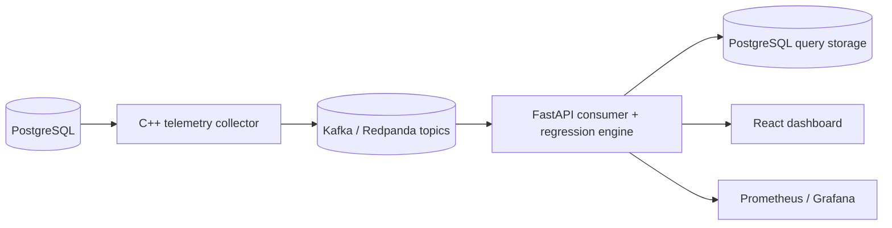

# QueryLens

QueryLens is a local observability stack for PostgreSQL query performance.

It collects query telemetry, fingerprints normalized SQL, captures safe plan snapshots, and flags deterministic regressions. The system also includes idempotent ingestion, bounded retries, and DLQ handling so failures stay visible.

## Architecture



## What’s included

- SQL normalization and fingerprinting
- Vector operator detection
- Safe EXPLAIN gating
- Kafka-backed telemetry ingestion
- Regression classification
- Prometheus metrics and Grafana dashboards
- Demo, benchmark, and evaluation workflows

## Not included

- Exactly-once delivery guarantees
- Kubernetes manifests
- gRPC APIs
- Managed cloud deployment

## Quick start

```bash
make setup
make build
make up
make migrate
make seed
make test
make demo
```

## Benchmarks

```bash
make benchmark N=10000
make benchmark N=50000
make benchmark-100k
make regression-eval
```

## Recommendations

- Query-specific deterministic recommendations live in `docs/RECOMMENDATIONS.md`
- The query detail page surfaces the latest rule-based suggestions beside plan and metric history

## Resume-safe summary

Built a PostgreSQL observability platform that streams telemetry, detects regressions deterministically, and provides reproducible evaluation and monitoring workflows end to end.

## Portfolio Proof

- Architecture and evaluation: [docs/PORTFOLIO_PROOF.md](docs/PORTFOLIO_PROOF.md)
- Benchmark artifacts: [docs/BENCHMARKS.md](docs/BENCHMARKS.md)
- Recommendations: [docs/RECOMMENDATIONS.md](docs/RECOMMENDATIONS.md)
- Demo and local mode: use the repo `make` targets documented above
- Test commands: backend pytest, frontend `npm run build`
- Evidence: regression evaluation docs under `docs/`
