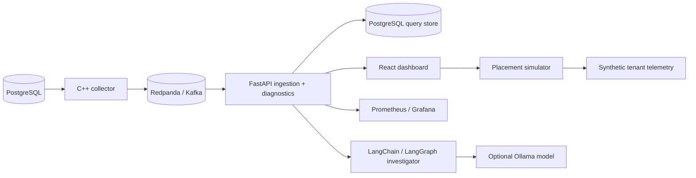

# PlanTrace | Agentic SQL Diagnostics & Workload Intelligence Platform

PlanTrace is a local database systems project focused on PostgreSQL query telemetry, EXPLAIN ANALYZE diagnostics, optimizer regression detection, an evidence-grounded Query Regression Investigator, and a synthetic multi-tenant SQL placement simulator.

The frontend now has a public product-style landing page at `/`, a workspace shell at `/app`, a query telemetry view at `/app/queries`, regression and placement views, a saved reports hub, and a `/learn` page that explains the architecture and demo mode.

GitHub About / description: `SQL Query Diagnostics & Workload Optimization Platform`

It is intentionally honest in scope:

- PostgreSQL query telemetry and plan capture are real
- Optimizer regression detection is deterministic
- The Query Regression Investigator is evidence-grounded and can run with a fake provider in CI or local Ollama when enabled
- Placement is a simulated what-if engine over synthetic tenant telemetry
- It is not a production Azure SQL deployment and does not claim to manage live cloud clusters
- The backend still uses the internal `querylens` schema and `querylens_*` metrics for compatibility; the public project name is PlanTrace

## Architecture



## What it does

- Fingerprints normalized SQL so semantically identical statements collapse to one hash
- Captures query metrics and EXPLAIN JSON / EXPLAIN ANALYZE evidence
- Detects deterministic optimizer regressions:
  - row-estimate mismatch
  - sequential-scan fallback
  - missing index candidates
  - temp / sort / hash spill
  - nested-loop explosion
  - pgvector / HNSW bypass
- Stores query plans, regressions, and diagnostic findings in PostgreSQL
- Streams telemetry through Kafka / Redpanda with bounded retry and DLQ handling
- Runs an evidence-grounded Query Regression Investigator that compacts telemetry, validates structured output, and falls back safely when evidence is thin
- Simulates multi-tenant placement strategies:
  - first-fit baseline
  - greedy best-fit
  - weighted scoring
  - local-search rebalancer

## Layout

- `backend/` FastAPI service, collector, diagnostics, placement simulator, migrations, and tests
- `collector/` C++ telemetry collector
- `frontend/` React product site plus dashboard workspace
- `docs/` architecture, demo, operations, regression rules, and benchmark notes
- `scripts/` benchmark and evaluation helpers
- `infra/` Postgres init SQL and Prometheus config

## Quick Start

Requires Python 3.11+ and Node 20+.

```bash
make setup
make build
make up
make migrate
make seed
make test
make demo
```

## Core Screens

- Landing page: public product story, architecture summary, demo preview, and validation snapshot
- Workspace overview: query latency, regressions, collector status
- Query telemetry: fingerprint detail, plan tree, recommendations, diagnostics, report generation, and the Query Regression Investigator
- Regressions: deterministic regression feed
- Placement simulator: synthetic tenant telemetry and before/after placement comparison
- Reports: saved investigation outputs when they exist
- Learn: route map, demo mode, and architecture notes

Screenshots live under [docs/screenshots](docs/screenshots/).

## Demo Flow

- Open `/` for the public landing page
- Open `/app?demo=1` to see the workspace with a visible demo mode banner
- Open `/app/queries`, `/app/regressions`, `/app/placement`, and `/app/reports` for the product workspace
- Open `/learn` for the architecture and demo explanation page

## API Examples

```bash
curl http://localhost:8765/health
curl http://localhost:8765/api/queries
curl http://localhost:8765/api/queries/<fingerprint-id>/diagnostics
curl -X POST http://localhost:8765/api/ai/query-investigation \
  -H 'content-type: application/json' \
  -d '{"query_id":"<fingerprint-id>"}'
curl -X POST http://localhost:8765/api/placement/simulate \
  -H 'content-type: application/json' \
  -d '{"seed":42,"tenants":48,"regions":3,"clusters_per_region":2,"nodes_per_cluster":3}'
```

## Benchmark Methodology

The benchmark workflow is documented in [docs/BENCHMARKS.md](docs/BENCHMARKS.md).

In short:

- telemetry benchmark events are produced into Kafka
- the backend consumer measures ingest latency, lag, duplicates, and DLQ counts
- regression detection uses deterministic seeded scenarios
- placement simulation is evaluated on synthetic tenant telemetry, not live customer clusters

## Testing

```bash
cd backend && .venv/bin/python -m pytest tests -v
cd backend && .venv/bin/ruff check app tests
cd frontend && npm run build
python scripts/evaluate_query_investigator.py
```

`npm run build` prints a Rollup chunk-size warning (main bundle > 500 kB); this is non-blocking and does not affect the build output.

## Query Regression Investigator

The investigator reads query fingerprints, latency trends, regression records, and diagnostics, then returns a structured report with summary, risk level, confidence, likely causes, evidence, and suggested actions.

- Default mode: `AI_PROVIDER=disabled`
- Local Ollama mode: set `AI_PROVIDER=ollama`, `OLLAMA_BASE_URL=http://localhost:11434`, `AI_MODEL=qwen2.5-coder:7b`, and optionally `AI_FALLBACK_MODEL=llama3.1:8b`
- CI mode: fake provider tests exercise the full workflow without requiring Ollama
- Evaluation: `python scripts/evaluate_query_investigator.py --provider fake`

More setup details live in [docs/AI_INVESTIGATOR.md](docs/AI_INVESTIGATOR.md).

## Resume-Ready Summary

Built a database telemetry platform that streams PostgreSQL query events from a C++ collector through Kafka into FastAPI and React dashboards for query debugging, optimizer regression analysis, and synthetic placement simulation.

Implemented deterministic EXPLAIN ANALYZE diagnostics and query fingerprinting to detect row-estimate mismatch, sequential-scan fallbacks, temp spills, nested-loop explosions, and pgvector/HNSW bypass patterns.

Added a synthetic multi-tenant placement engine with first-fit, greedy best-fit, weighted scoring, and local-search strategies to compare overloaded-node counts, utilization balance, migration cost, hotspot reduction, and p95 placement latency.

Added an evidence-grounded Query Regression Investigator that uses LangChain/LangGraph with optional Ollama support and a fake provider path for tests and CI.
