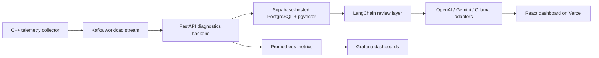

# PlanTrace

PlanTrace is an AI-powered SQL performance intelligence platform for PostgreSQL workloads.
It combines C++ telemetry collection, Kafka streaming, FastAPI diagnostics, Supabase-hosted PostgreSQL + pgvector, a LangChain review layer with OpenAI/Gemini/Ollama adapters, a React dashboard deployable on Vercel, and Prometheus/Grafana observability.

## Architecture



Local development uses the same shape with Docker Compose:

- C++ collector
- Redpanda Kafka-compatible stream
- FastAPI backend
- PostgreSQL/pgvector local stack or Supabase connection
- React UI
- Prometheus + Grafana

## What It Does

- Fingerprints normalized SQL so semantically identical statements collapse to one hash
- Captures metrics and EXPLAIN evidence for query regression analysis
- Detects deterministic regressions:
  - row-estimate mismatch
  - sequential-scan fallback
  - missing index candidate
  - temp / sort / hash spill
  - nested-loop explosion
  - pgvector / HNSW bypass
  - vector operator mismatch
  - cost spike
  - call spike
- Runs an AI SQL Copilot that returns:
  - root-cause explanation
  - query rewrite suggestion
  - index recommendation
  - EXPLAIN diff summary
  - confidence score
  - evidence citations
  - unsupported-claim guardrails
  - remediation priority
  - regression timeline explanation
  - affected fingerprint summary
- Simulates multi-tenant placement strategies:
  - first-fit
  - greedy best-fit
  - weighted scoring
  - local-search rebalancer
  - simulated annealing

## Deployment Topology

- Backend API: FastAPI
- Database: Supabase-hosted PostgreSQL with pgvector for the hosted architecture
- Review layer: LangChain with optional OpenAI, Gemini, or Ollama adapters
- Frontend: React app deployed on Vercel
- Metrics: Prometheus and Grafana

Environment variables for hosted use:

```bash
SUPABASE_DATABASE_URL=postgresql+psycopg://...
VITE_API_BASE_URL=https://your-backend.example.com
AI_PROVIDER=auto
OPENAI_API_KEY=
GEMINI_API_KEY=
OLLAMA_BASE_URL=http://localhost:11434
```

The backend falls back to `DATABASE_URL` when `SUPABASE_DATABASE_URL` is not set.

## Local Preview

- Frontend: [http://localhost:5172](http://localhost:5172)
- Backend API: [http://localhost:8201](http://localhost:8201)
- Prometheus: [http://localhost:9090](http://localhost:9090)
- Grafana: [http://localhost:3000](http://localhost:3000)

## Setup

```bash
make setup
make build
make up
make migrate
make seed
make test
make demo
```

## Verification Snapshot

Current checked-in proof in this branch:

- Backend tests: 70 passed
- Frontend build: passed
- AI investigator eval: 12 golden cases, schema validity 1.0, evidence coverage 1.0, unsupported claim rate 0.0, recommendation relevance 1.0
- Regression eval: 9 scenarios, precision 1.0, recall 1.0, F1 1.0
- Placement eval: 4 scenarios, 5 algorithms, synthetic what-if only
- Synthetic benchmark artifacts: 10K, 50K, 100K local runs plus pending 250K, 500K, and 1M presets

Benchmark and eval outputs are written to `backend/benchmark_results/`.

## Screenshots

Rendered screenshots and captures live under `docs/screenshots/` as image assets.

## API

```bash
curl http://localhost:8201/health
curl http://localhost:8201/api/queries
curl http://localhost:8201/api/queries/<fingerprint-id>/diagnostics
curl -X POST http://localhost:8201/api/ai/query-investigation \
  -H 'content-type: application/json' \
  -d '{"query_id":"<fingerprint-id>"}'
curl -X POST http://localhost:8201/api/placement/simulate \
  -H 'content-type: application/json' \
  -d '{"seed":42,"tenants":48,"regions":3,"clusters_per_region":2,"nodes_per_cluster":3}'
```

## Testing

```bash
cd backend && python -m pytest tests -v
cd backend && ruff check app tests
cd frontend && npm run build
python scripts/evaluate_query_investigator.py --provider fake
python scripts/evaluate_placement.py
python scripts/generate_benchmark_summary.py
```

## Limits

- Placement simulation is synthetic and does not control live Azure resources
- The review layer is evidence-grounded and does not invent unsupported claims
- The hosted architecture assumes a separate backend deployment and a Vercel frontend
- The benchmark outputs are synthetic telemetry artifacts, not production throughput claims

## Resume-Ready Summary

- Built a PostgreSQL telemetry platform that streams query events from a C++ collector through Kafka into FastAPI diagnostics and React dashboards
- Added an AI SQL Copilot with grounded explanations, rewrites, index guidance, and strict output validation across OpenAI, Gemini, and Ollama adapters
- Implemented deterministic EXPLAIN diagnostics and regression detection for row-estimate mismatch, temp spill, nested-loop explosion, vector search regressions, and more
- Added a synthetic multi-tenant placement engine with multiple strategies and quantitative comparison metrics
- Produced benchmark and eval artifacts that back the claims in this repository
